# SakuMari Architecture Documentation

## System Architecture



**Core Stack:** Next.js 16.0.0 App Router + React 19.2.0 + NextAuth.js v5.0.0-beta.29 + PostgreSQL 17 + Google Gemini AI v0.24.1 + Upstash Redis Rate Limiting + TypeScript 5.9.3

**Key Components:**

- **Authentication:** Google OAuth + test credentials with 30-day JWT cookies
- **Pages:** HomePage, Practice (Hiragana/Katakana), Dashboard
- **State Management:** FlashcardProvider with confidence-weighted adaptive learning
- **Data Layer:** Prisma ORM 6.18.0 with PostgreSQL 17
- **AI Integration:** Google Gemini AI v0.24.1 for personalized learning recommendations
- **Rate Limiting:** Upstash Redis with @upstash/ratelimit v2.0.6 for API protection
- **Styling:** Tailwind CSS v4.1.16 with mobile-first responsive design
- **Testing:** Vitest v4.0.3 + Playwright v1.56.1 for comprehensive testing (unit, integration, E2E)
- **Code Quality:** ESLint 9.38.0 + Prettier with React, Import, and TypeScript plugins

## Component Architecture



**Design Principles:**

- **Separation of Concerns:** Clear boundaries between presentation and business logic
- **Component Composition:** Container → Presentation → Layout hierarchy
- **Context-Driven State:** React Context for global state, custom hooks for data fetching

**State Management:**

- **FlashcardProvider:** Confidence-weighted adaptive learning algorithm + flashcard state
- **SessionProviders:** NextAuth.js authentication context
- **Custom Hooks:** `useDashboardData`, `useSorting`, `useAuthStatus`, `useFlashcardInteraction`, `useFlashcardHandlers`
- **UI Components:** Modular `/components/ui/` directory with Button, ButtonLink, FilterButton
- **Error Handling:** API utilities (`lib/api-errors.ts`) and proxy utilities (`lib/api-middleware.ts`) for constraint violations and proper responses
- **Kana Filtering:** Character filtering utilities (`lib/kana-filter.ts`) for hiragana/katakana selection
- **Flashcard Utils:** Helper functions (`lib/flashcard-utils.ts`) and submission utilities (`lib/flashcard-submit-utils.ts`) for improved testability
- **Rate Limiting:** Upstash Redis utilities (`lib/rate-limit.ts`) for API endpoint protection

**Component Groups:**

### Core Components

- **HomePage** - Landing page with auth-aware content
- **FlashcardApp** - Main practice session container
- **FlashcardProvider** - Adaptive learning context
- **Header** - Global navigation + auth controls
- **SessionProviders** - Authentication wrapper

### Practice Components

- **Flashcard** - Dual input modes (typing/multiple-choice) with adaptive learning
- **ModeSelector** - Input mode toggle
- **MultipleChoice** - Multiple-choice interface
- **FilterButton** - Character type filtering (hiragana/katakana/all)

### Dashboard Components

- **Dashboard** - Progress tracking overview
- **StatsSummary** - Statistics cards
- **CharacterProgressTable** - Sortable/filterable progress data
- **TipsModal** - AI chat interface

### Navigation Components

- **DesktopNavigation** - Desktop navigation menu
- **MobileNavigation** - Mobile navigation menu

### UI Components

- **Button** - Consistent button interface (`/components/ui/`)
- **ButtonLink** - Link-style button component (`/components/ui/`)
- **FilterButton** - Character type selection (`/components/ui/`)

**API Endpoints:**

- `GET /api/stats` - Progress data (protected, rate limited: 30/min, 200/min in tests)
- `POST /api/flashcards/submit` - Answer processing (protected, rate limited: 100/min, 500/min in tests)
- `POST /api/tips` - AI learning tips (protected, rate limited: 10/min, 50/min in tests)
- `GET /api/auth/providers` - Available login options (rate limited: 10/min, 200/min in tests)
- `POST /api/auth/[...nextauth]` - Authentication session management (rate limited: 10/min, 200/min in tests)
- `GET /api/health` - System health monitoring (public, rate limited: 60/min, 200/min in tests)

**Route Protection:**

- Protected: `/hiragana`, `/katakana`, `/dashboard`, `/api/stats`, `/api/flashcards/*`, `/api/tips`
- Public: `/`, `/api/auth/*`, `/api/health`
- Proxy enforces authentication for practice and progress APIs

## App Architecture



**Next.js 16 App Router** - File-system based routing with enhanced SSR capabilities

**Key Features:**

- **File-based Routing:** `page.tsx` → automatic routes, `layout.tsx` → shared UI
- **Hybrid Rendering:** Server components (default) + client components (`"use client"`)
- **Co-located APIs:** Route handlers alongside pages
- **SEO Optimized:** Dynamic `sitemap.ts`, `robots.ts`, and page-level metadata
- **Performance:** Automatic code splitting, SSR, and static generation with React 19.2.0
- **Health Monitoring:** Database connectivity endpoint (`/api/health`)
- **Proxy Protection:** Enforcement for practice and progress APIs
- **Rate Limiting:** Upstash Redis-based protection with fail-open error handling
- **Type Safety:** TypeScript 5.9.3 with dedicated `/types/` directory

## Project Structure

**Route Structure:**

```
app/
├── page.tsx              # Homepage
├── layout.tsx            # Root layout
├── globals.css           # Global styles
├── robots.ts             # SEO configuration
├── sitemap.ts            # Dynamic sitemap
├── hiragana/page.tsx     # Hiragana practice (protected)
├── katakana/page.tsx     # Katakana practice (protected)
├── dashboard/page.tsx    # Progress dashboard (protected)
├── api/
│   ├── auth/             # Authentication routes
│   ├── stats/            # Progress data API (protected)
│   ├── flashcards/       # Flashcard APIs (protected)
│   ├── tips/             # AI learning tips (protected)
│   └── health/           # System health monitoring
└── proxy.ts              # Route protection
```

**Core Libraries:**

```
lib/
├── auth.ts                     # NextAuth.js configuration
├── prisma.ts                   # Database client
├── env.ts                      # Environment variables
├── api-errors.ts               # API error handling
├── api-middleware.ts           # API proxy functions
├── backgrounds.ts              # Background management utilities
├── metadata.ts                 # SEO & metadata
├── kana-filter.ts              # Character filtering
├── flashcard-utils.ts          # Flashcard helpers
├── flashcard-submit-utils.ts   # Submission utilities
├── rate-limit.ts               # Upstash Redis rate limiting
└── should-fetch-kana-data.ts   # Data fetching utilities
```

**Custom Hooks:**

```
hooks/
├── useAuthStatus.ts            # Authentication state
├── useDashboardData.ts         # Dashboard data fetching
├── useFlashcardHandlers.ts     # Mode and choice handling
├── useFlashcardInteraction.ts  # Card interaction logic
└── useSorting.ts               # Table sorting
```

**Testing:**

```
__tests__/
├── api/                        # API endpoint tests
├── auth/                       # Authentication flow tests
├── db/                         # Database tests (SQLite)
├── e2e/                        # End-to-end Playwright tests
├── hooks/                      # Custom hooks tests
├── flashcard-provider/         # Provider logic tests
├── seo/                        # SEO and metadata tests
└── utils/                      # Test utilities
```

## Database Schema

### Application Tables

**Kana Table**

- `id` (UUID) - Primary key
- `character` (String, unique) - Hiragana/Katakana character
- `romaji` (String) - Romanized pronunciation
- `progress` (relation) - One-to-many relationship to KanaProgress

**KanaProgress Table**

- `id` (UUID) - Primary key
- `kana_id` (String) - Foreign key to Kana table
- `user_id` (String) - Foreign key to User table
- `attempts` (Int, default: 0) - Total practice attempts
- `correct_attempts` (Int, default: 0) - Correct answer count
- `accuracy` (Float, default: 0) - Calculated accuracy percentage
- Unique constraint on (kana_id, user_id) - One progress record per user per character

### Authentication Tables (NextAuth.js)

**User Table**

- `id` (String, cuid) - Primary key
- `name` (String, nullable) - Display name
- `email` (String, unique, nullable) - Email address
- `emailVerified` (DateTime, nullable) - Email verification timestamp
- `image` (String, nullable) - Profile image URL
- `accounts` (relation) - One-to-many to Account
- `sessions` (relation) - One-to-many to Session
- `kanaProgress` (relation) - One-to-many to KanaProgress

**Account Table**

- `id` (String, cuid) - Primary key
- `userId` (String) - Foreign key to User
- `type` (String) - OAuth provider type
- `provider` (String) - OAuth provider name
- `providerAccountId` (String) - Provider-specific user ID
- OAuth tokens: `refresh_token`, `access_token`, `id_token` (Text, nullable)
- Token metadata: `expires_at`, `token_type`, `scope`, `session_state`
- Unique constraint on (provider, providerAccountId)

**Session Table**

- `id` (String, cuid) - Primary key
- `sessionToken` (String, unique) - JWT session token
- `userId` (String) - Foreign key to User
- `expires` (DateTime) - Session expiration

**VerificationToken Table**

- `identifier` (String) - Email address or user identifier
- `token` (String, unique) - Verification token
- `expires` (DateTime) - Token expiration
- Unique constraint on (identifier, token)

### Key Relationships

- **User-KanaProgress**: One-to-many relationship for user progress tracking
- **Kana-KanaProgress**: One-to-many relationship for character progress
- **User-Account/Session**: One-to-many relationships for authentication
- **Cascading Deletes**: User deletions cascade to accounts, sessions, and progress

## Database Security

### Row Level Security (RLS)

**PostgreSQL RLS** protects all sensitive tables with application-level filtering policies:

| Table | Purpose | Access Level |
|-------|---------|--------------|
| `users` | User profiles | Self-updates only |
| `accounts` | OAuth connections | Application-filtered |
| `sessions` | Session management | Application-filtered |
| `verificationtokens` | Email verification | Application-filtered |
| `kanaprogress` | Learning progress | Application-filtered |

**Public Tables:**

- `kana` - Reference data (Hiragana/Katakana characters) - no RLS needed

**Security Implementation:**

- Permissive policies with `USING (true)` for application-level control
- Prisma ORM handles access control logic
- Migration history with security fixes in 2025-10-06
- Comprehensive RLS configuration tests in `__tests__/db/rls.test.ts`

## Development

```
docker/
├── Dockerfile                  # Application container
└── docker-compose.yml          # PostgreSQL development
scripts/
└── manage-license-headers.js   # License management
generated/
└── prisma_client/              # Custom Prisma client output
```
