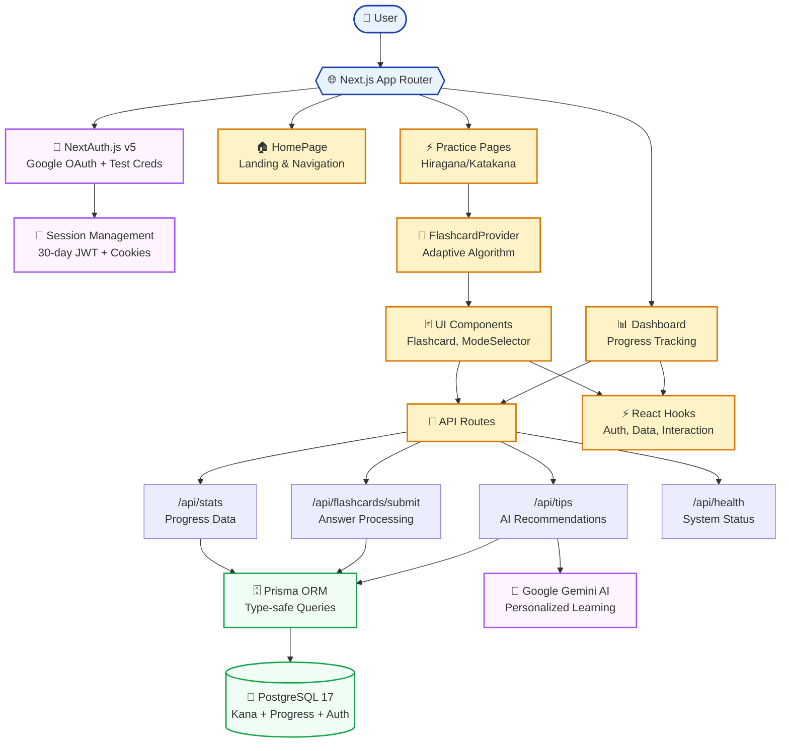

# SakuMari Architecture Documentation

This document provides comprehensive architectural documentation for SakuMari, a Japanese Kana flashcard app built with Next.js 15.

## System Architecture

SakuMari uses a modern Next.js 15 App Router architecture that seamlessly integrates client-side interactivity with server-side efficiency. The system centers around authenticated user sessions managed by NextAuth.js v5, flowing through three main page routes (HomePage, Practice Pages, Dashboard) that connect to a unified API layer. The FlashcardProvider manages adaptive learning state using React Context, while custom hooks handle data fetching and user interactions. All user progress flows through Prisma ORM to PostgreSQL 17, with Google Gemini AI providing personalized learning recommendations.

## Component Architecture

The application follows a hierarchical component structure with clear separation of concerns. Components are organized into logical groups: Core components handle routing and context management, Practice components manage flashcard interactions, Dashboard components display progress data, and UI components provide reusable interface elements.

```mermaid
flowchart TD
    %% Authentication Layer
    SessionProviders["🔐 SessionProviders<br/>Authentication Context Provider<br/>NextAuth.js Session Management"]

    %% Root Application Structure
    SessionProviders --> HomePage["🏠 HomePage<br/>Landing Page Component<br/>Authentication-aware Content"]
    SessionProviders --> FlashcardApp["⚡ FlashcardApp<br/>Main Practice Application<br/>Container for All Practice Features"]

    %% Core Application Components
    FlashcardApp --> Header["📋 Header<br/>Global Navigation Component<br/>Authentication Controls"]
    FlashcardApp --> FlashcardProvider["🎯 FlashcardProvider<br/>React Context Provider<br/>Adaptive Learning Algorithm & State"]

    %% Navigation Components (Header Children)
    Header --> DesktopNavigation["🖥️ DesktopNavigation<br/>Desktop Menu Interface<br/>Large Screen Navigation"]
    Header --> MobileNavigation["📱 MobileNavigation<br/>Mobile Menu Interface<br/>Responsive Navigation"]

    %% Practice Flow Components
    FlashcardProvider --> Flashcard["🃏 Flashcard<br/>Main Practice Interface<br/>Dual Input Mode Support"]

    Flashcard --> ModeSelector["⌨️ ModeSelector<br/>Input Mode Toggle<br/>Typing vs Multiple Choice"]
    Flashcard --> MultipleChoice["📝 MultipleChoice<br/>Multiple Choice Interface<br/>Answer Selection UI"]

    %% Dashboard and Progress Components
    FlashcardApp --> Dashboard["📊 Dashboard<br/>Progress Tracking Main View<br/>Statistics and Analytics"]

    Dashboard --> StatsSummary["📈 StatsSummary<br/>Progress Overview Cards<br/>Key Metrics Display"]
    Dashboard --> CharacterProgressTable["📋 CharacterProgressTable<br/>Detailed Progress Table<br/>Character-level Statistics"]
    Dashboard --> TipsModal["🤖 TipsModal<br/>AI Chat Interface<br/>Personalized Learning Tips"]

    %% Table Sub-Components
    CharacterProgressTable --> SortableTableHeader["🔄 SortableTableHeader<br/>Column Sorting Controls<br/>Dynamic Table Ordering"]
    CharacterProgressTable --> CharacterTableRow["📝 CharacterTableRow<br/>Individual Character Stats<br/>Progress Data Display"]

    %% Custom Hooks Integration
    Dashboard --> useDashboardData["🔧 useDashboardData<br/>Data Fetching Hook<br/>Progress Statistics API"]
    Dashboard --> useSorting["🔧 useSorting<br/>Table Sorting Hook<br/>Column Sort Logic"]
    Header --> useAuthStatus["🔧 useAuthStatus<br/>Authentication Hook<br/>Session State Management"]

    %% Reusable UI Components
    Button["🔘 Button<br/>Reusable Button Component<br/>Consistent UI Element"]
    ButtonLink["🔗 ButtonLink<br/>Link Button Component<br/>Navigation UI Element"]

    %% Component Usage Relationships
    HomePage -.-> Header
    HomePage -.-> ButtonLink
    Dashboard -.-> Button
    Dashboard -.-> ButtonLink
    ModeSelector -.-> Button
    MultipleChoice -.-> Button
    Flashcard -.-> Button

    %% Context Provider Relationships
    FlashcardProvider -.-> Flashcard
    FlashcardProvider -.-> ModeSelector
    FlashcardProvider -.-> MultipleChoice
    SessionProviders -.-> Dashboard

    %% Styling Classes
    classDef coreComponent fill:#e8f4fd,stroke:#1e40af,stroke-width:2px
    classDef practiceComponent fill:#fef3c7,stroke:#d97706,stroke-width:2px
    classDef dashboardComponent fill:#f0fdf4,stroke:#16a34a,stroke-width:2px
    classDef uiComponent fill:#fdf4ff,stroke:#a855f7,stroke-width:2px
    classDef contextProvider fill:#fee2e2,stroke:#dc2626,stroke-width:3px
    classDef customHook fill:#f3f4f6,stroke:#6b7280,stroke-width:2px,stroke-dasharray: 5 5

    class SessionProviders,HomePage,FlashcardApp,Header,DesktopNavigation,MobileNavigation coreComponent
    class Flashcard,ModeSelector,MultipleChoice,FlashcardProvider practiceComponent
    class Dashboard,StatsSummary,CharacterProgressTable,SortableTableHeader,CharacterTableRow,TipsModal dashboardComponent
    class Button,ButtonLink uiComponent
    class FlashcardProvider,SessionProviders contextProvider
    class useDashboardData,useSorting,useAuthStatus customHook
```

## Key Architectural Patterns

### Context-Based State Management

- **FlashcardProvider**: Manages adaptive learning algorithm, flashcard state, and user interactions
- **SessionProviders**: Wraps the app with NextAuth.js session context for authentication

### Component Composition

- **Container Components**: FlashcardApp, Dashboard handle overall page logic
- **Presentation Components**: Flashcard, ModeSelector focus on user interface
- **Layout Components**: Header provides navigation across all pages

### Data Flow Patterns

- **Top-Down Props**: Parent components pass configuration and callbacks to children
- **Context Consumption**: Components access shared state through React Context hooks
- **Custom Hooks**: Encapsulate data fetching and business logic (useDashboardData, useSorting, useAuthStatus)

### Responsive Design Strategy

- **Mobile-First**: Components include responsive breakpoints (sm:, lg:)
- **Adaptive Navigation**: Separate desktop and mobile navigation components
- **Progressive Enhancement**: Core functionality works on all devices, enhanced features on larger screens

### Component Categories

#### Core Components

- **HomePage**: Landing page with authentication-aware content
- **FlashcardApp**: Main container for practice sessions
- **Header**: Global navigation with authentication controls
- **SessionProviders**: Authentication context wrapper

#### Practice Components

- **FlashcardProvider**: Context provider for flashcard logic and adaptive algorithm
- **Flashcard**: Main practice interface with dual input modes
- **ModeSelector**: Toggle between typing and multiple-choice modes
- **MultipleChoice**: Multiple-choice answer interface

#### Dashboard Components

- **Dashboard**: Progress tracking main view
- **StatsSummary**: Overview statistics cards
- **CharacterProgressTable**: Detailed progress table with filtering and sorting
- **TipsModal**: Modal interface for AI chat functionality

#### Supporting Components

- **Navigation Components**: DesktopNavigation, MobileNavigation for responsive menus
- **Table Components**: SortableTableHeader, CharacterTableRow for data presentation
- **UI Components**: Button, ButtonLink for consistent interface elements

This architecture ensures maintainable code through clear component boundaries, predictable data flow, and separation of concerns between presentation and business logic.

## App Architecture

The SakuMari app follows the Next.js 15 App Router paradigm, which provides a file-system based routing structure with enhanced capabilities for layouts, middleware, and API routes. The app directory serves as the foundation for all pages, API endpoints, and shared resources, creating a cohesive and scalable application structure.

The App Router architecture enables server-side rendering, static site generation, and client-side routing seamlessly. Each page.tsx file becomes a route, while layout.tsx files provide shared UI components across route segments. API routes are co-located with pages, making the codebase more organized and maintainable.

```mermaid
flowchart TD
    %% Root App Structure
    AppRoot["📁 app/<br/>Next.js 15 App Router Root<br/>File-based Routing System"]
    
    %% Root Layout and Global Files
    AppRoot --> RootLayout["📄 layout.tsx<br/>Root Layout Component<br/>Global HTML Structure + Metadata"]
    AppRoot --> GlobalCSS["🎨 globals.css<br/>Global Styles<br/>Tailwind CSS Imports"]
    AppRoot --> Favicon["🖼️ favicon.ico<br/>App Icon<br/>Browser Tab Icon"]
    
    %% SEO and Meta Files
    AppRoot --> SitemapTS["🗺️ sitemap.ts<br/>Dynamic Sitemap<br/>SEO Route Discovery"]
    AppRoot --> RobotsTS["🤖 robots.ts<br/>Robots.txt Config<br/>Search Engine Rules"]
    
    %% Page Routes (Direct Children)
    AppRoot --> HomePage["🏠 page.tsx<br/>Root Page (Home)<br/>Landing Page Route"]
    AppRoot --> DashboardDir["📁 dashboard/<br/>Dashboard Route Segment<br/>Protected User Statistics"]
    AppRoot --> HiraganaDir["📁 hiragana/<br/>Hiragana Practice Route<br/>Character Learning Mode"]
    AppRoot --> KatakanaDir["📁 katakana/<br/>Katakana Practice Route<br/>Character Learning Mode"]
    
    %% Page Route Files
    DashboardDir --> DashboardPage["📄 page.tsx<br/>Dashboard Page<br/>Progress Tracking UI"]
    HiraganaDir --> HiraganaPage["📄 page.tsx<br/>Hiragana Practice<br/>Interactive Flashcard Session"]
    KatakanaDir --> KatakanaPage["📄 page.tsx<br/>Katakana Practice<br/>Interactive Flashcard Session"]
    
    %% API Routes Structure
    AppRoot --> APIRoot["📁 api/<br/>API Routes Directory<br/>Server-side Endpoints"]
    
    %% Authentication API Routes
    APIRoot --> AuthDir["📁 auth/<br/>Authentication Routes<br/>NextAuth.js Integration"]
    AuthDir --> NextAuthRoute["📁 [...nextauth]/<br/>Dynamic Auth Route<br/>OAuth + Session Management"]
    NextAuthRoute --> NextAuthFile["📄 route.ts<br/>NextAuth Handler<br/>Login/Logout/Session"]
    AuthDir --> ProvidersRoute["📁 providers/<br/>Auth Providers Route<br/>Available Login Methods"]
    ProvidersRoute --> ProvidersFile["📄 route.ts<br/>Providers API<br/>OAuth Configuration"]
    
    %% Application API Routes
    APIRoot --> FlashcardsDir["📁 flashcards/<br/>Flashcard API Routes<br/>Practice Session Data"]
    FlashcardsDir --> SubmitDir["📁 submit/<br/>Answer Submission<br/>Progress Tracking"]
    SubmitDir --> SubmitFile["📄 route.ts<br/>Submit API<br/>Answer Processing + Statistics"]
    
    APIRoot --> StatsDir["📁 stats/<br/>Statistics Route<br/>User Progress Data"]
    StatsDir --> StatsFile["📄 route.ts<br/>Stats API<br/>Dashboard Data Aggregation"]
    
    APIRoot --> TipsDir["📁 tips/<br/>AI Tips Route<br/>Personalized Learning"]
    TipsDir --> TipsFile["📄 route.ts<br/>Tips API<br/>Gemini AI Integration"]
    
    APIRoot --> HealthDir["📁 health/<br/>Health Check Route<br/>System Monitoring"]
    HealthDir --> HealthFile["📄 route.ts<br/>Health API<br/>Database Connectivity"]
    
    %% Layout Inheritance Flow
    RootLayout -.-> HomePage
    RootLayout -.-> DashboardPage
    RootLayout -.-> HiraganaPage
    RootLayout -.-> KatakanaPage
    
    %% API Route Usage by Pages
    HomePage -.-> NextAuthFile
    HomePage -.-> ProvidersFile
    DashboardPage -.-> StatsFile
    DashboardPage -.-> TipsFile
    HiraganaPage -.-> SubmitFile
    KatakanaPage -.-> SubmitFile
    
    %% Metadata and SEO Integration
    SitemapTS -.-> HomePage
    SitemapTS -.-> DashboardPage
    SitemapTS -.-> HiraganaPage
    SitemapTS -.-> KatakanaPage
    RobotsTS -.-> SitemapTS
    
    %% Component Integration
    HomePage --> HomePageComponent["🧩 HomePage Component<br/>Landing Interface<br/>Authentication State"]
    DashboardPage --> DashboardComponent["🧩 Dashboard Component<br/>Statistics Interface<br/>Progress Visualization"]
    HiraganaPage --> FlashcardAppComponent["🧩 FlashcardApp Component<br/>Practice Interface<br/>Adaptive Learning"]
    KatakanaPage --> FlashcardAppComponent
    
    %% Styling
    classDef rootStructure fill:#e8f4fd,stroke:#1e40af,stroke-width:3px
    classDef pageRoute fill:#fef3c7,stroke:#d97706,stroke-width:2px
    classDef apiRoute fill:#f0fdf4,stroke:#16a34a,stroke-width:2px
    classDef authRoute fill:#fdf4ff,stroke:#a855f7,stroke-width:2px
    classDef globalFile fill:#fee2e2,stroke:#dc2626,stroke-width:2px
    classDef component fill:#f3f4f6,stroke:#6b7280,stroke-width:2px,stroke-dasharray: 5 5
    
    class AppRoot,RootLayout rootStructure
    class HomePage,DashboardDir,DashboardPage,HiraganaDir,HiraganaPage,KatakanaDir,KatakanaPage pageRoute
    class APIRoot,FlashcardsDir,SubmitDir,SubmitFile,StatsDir,StatsFile,TipsDir,TipsFile,HealthDir,HealthFile apiRoute
    class AuthDir,NextAuthRoute,NextAuthFile,ProvidersRoute,ProvidersFile authRoute
    class GlobalCSS,Favicon,SitemapTS,RobotsTS globalFile
    class HomePageComponent,DashboardComponent,FlashcardAppComponent component
```

### App Router Key Features

#### File-based Routing
- **Automatic Route Creation**: Each `page.tsx` file automatically becomes a route
- **Nested Routes**: Folder structure maps directly to URL structure
- **Layout Inheritance**: `layout.tsx` files provide shared UI across route segments

#### Server and Client Components
- **Server Components**: Default rendering on the server for better performance
- **Client Components**: Interactive components with `"use client"` directive
- **Hybrid Rendering**: Seamless integration of server and client components

#### API Route Integration
- **Co-located APIs**: API routes live alongside pages for better organization
- **Route Handlers**: Modern `route.ts` files replace legacy API pages
- **Dynamic Routes**: `[...nextauth]` enables catch-all authentication routes

#### Metadata and SEO
- **Page-level Metadata**: Each page can export metadata for SEO optimization
- **Dynamic Generation**: `sitemap.ts` and `robots.ts` generate SEO files automatically
- **Structured Data**: JSON-LD schema markup for search engines

#### Performance Optimizations
- **Automatic Code Splitting**: Routes are automatically split for optimal loading
- **Server-side Rendering**: Enhanced SSR capabilities with React Server Components
- **Static Generation**: Build-time optimization for non-dynamic content

This App Router architecture provides a scalable foundation that separates concerns while maintaining close relationships between related functionality, enabling efficient development and optimal user experience.
